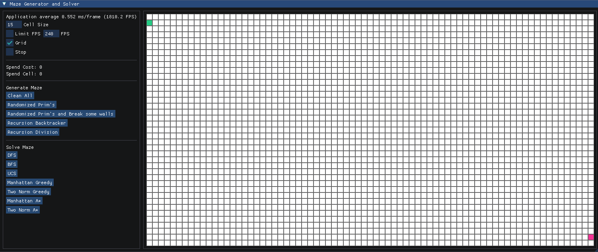

# Mase

The reason this project called Mase is beacause my name is Mes :p

*Mase* is an cross platform project for the visualization of maze generalization and maze solver algorithm.

It was made by C++17 and ImGui, with the OpenGL and glfw/glad backend.



> There was an Qt version before but no longer maintain anymore.

# Implemented algorithm

For generalizing maze, there are three implementations now:

- [Randomized Prim's algorithm](https://en.wikipedia.org/wiki/Maze_generation_algorithm#Iterative_randomized_Prim's_algorithm_(without_stack,_without_sets))
- [Randomized depth-first search](https://en.wikipedia.org/wiki/Maze_generation_algorithm#Randomized_depth-first_search)
- [Recursive division method](https://en.wikipedia.org/wiki/Maze_generation_algorithm#Recursive_division_method)

For solving maze, there are five implementations now:

- [BFS](https://en.wikipedia.org/wiki/Breadth-first_search)
- [DFS](https://en.wikipedia.org/wiki/Depth-first_search)
- [UCS(uniform cost search)](https://en.wikipedia.org/wiki/Dijkstra%27s_algorithm#Practical_optimizations_and_infinite_graphs)
- [Greedy](https://en.wikipedia.org/wiki/Greedy_algorithm)
- [A\*](https://en.wikipedia.org/wiki/A*_search_algorithm)

There are two heuristic functions now:

- [Euclidean distance(two norm)](https://en.wikipedia.org/wiki/Euclidean_distance)
- [Taxicab geometry](https://en.wikipedia.org/wiki/Taxicab_geometry)

# Dependencies

- OpenGL
- C++17

# How to build

```bash
git clone https://github.com/Mes0903/Mes_Imgui_template.git
cd Mes_Imgui_template
git submodule init
git submodule update
mkdir build && cd build
cmake ..
cmake --build .
```

For Doxygen:

```bash
cd document
doxygen ./Doxyfile
```

## wsl

if you are using WSL as your environment, you may encounter the wayland-scanner error:

> ... failed to find wayland-scanner

In this case, you can uncomment the cmake flag for glfw to disable wayland:

```cmake
# in the 3rdparty/CMakeLists.txt

if(UNIX)
  set(GLFW_BUILD_DOCS OFF CACHE BOOL "" FORCE)
  set(GLFW_BUILD_TESTS OFF CACHE BOOL "" FORCE)
  set(GLFW_BUILD_EXAMPLES OFF CACHE BOOL "" FORCE)
  set(GLFW_BUILD_WAYLAND OFF CACHE BOOL "" FORCE)
endif()

add_subdirectory(glfw)
# ... the remain content
```

## glad

Glad in this project is for opengl 4.6, so you may need to change the version of glad if you are using a different version of OpenGL.

You can download the correspond version on the [glad loader website](https://glad.dav1d.de/).